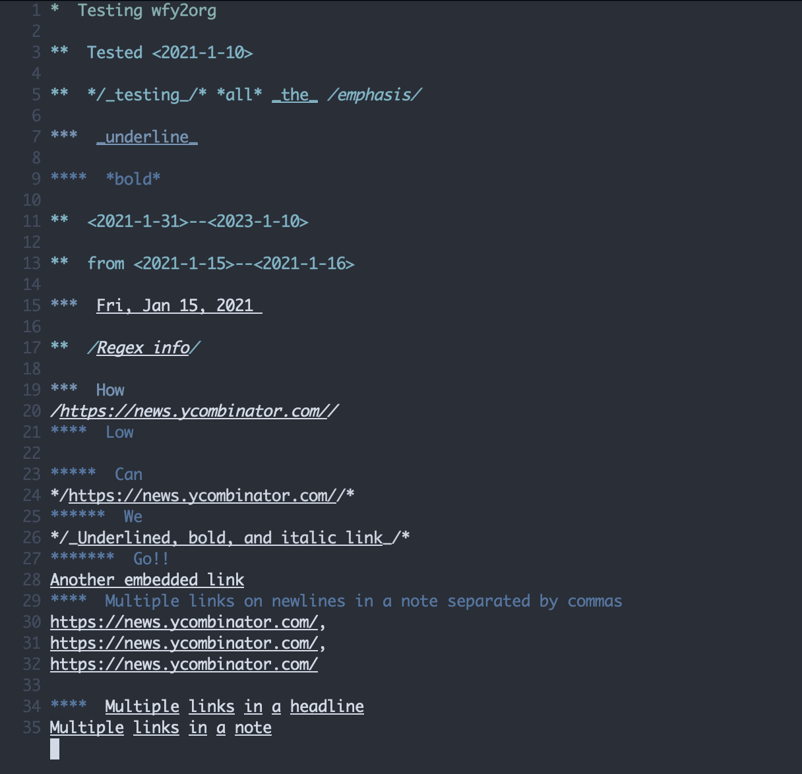

# wfy2org

Converts OPML exports from [Workflowy](https://workflowy.com/) to [Org Mode](https://orgmode.org/) plain text markup.

## Usage

`wfy2org` outputs to **stdout**.

Input is currently hardcoded to use the export file, **workflowy-export.opml**, in the current working directory. It will be changed to take an input file.

## Example

From

to

